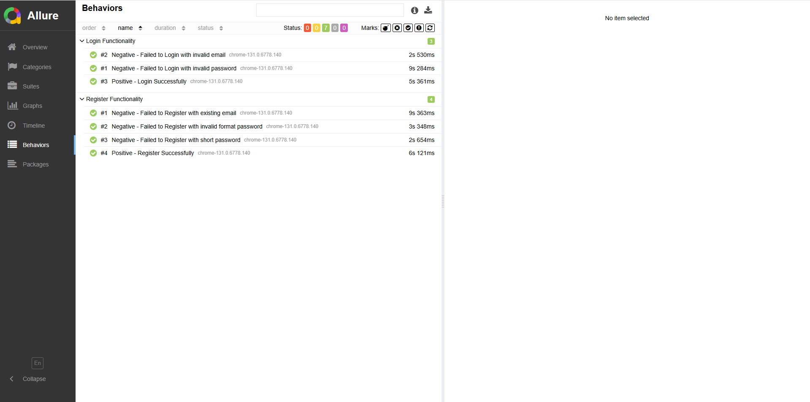

# Web Automation using WebdriverIO and Cucumber on Magento Luma

<p align="center">
    
</p>

This project focused on practicing functional web automation testing on the Magento website using WebdriverIO and Cucumber. The goal of this project is to enhance skills in automation testing, currently covering critical user workflows such as login, and registration. The project leverages **Cucumber** for structuring the test scenarios in Gherkin syntax, **allure-reporter** for clear and readable test reporting, and **chromedriver** to run the tests in the Chrome browser.

## 🚀 Project Overview

The project by file feature include:
- **login.feature**: Automate scenario of the login proccess with the positive and negative flow.
- **register.featuret**: Automate scenario of the register proccess with the positive and negative flow.

## **├─** Project Structure
 ```bash
├───main
    ├───pageObjects
    └───utilities
└───test
    ├───features
    └───steps
 ```

## Screenshot of Allure Reporter



## 📌 Current Status
The project is currently under development, and there will be many updates in the future. In the meantime, the Functionality of this project is running well as expected.

## 🛠️ Tools Used

- **WebdriverIO**
- **Cucumber Framework**
- **Allre Reporter**
- **ChromeDriver**
- **Magento Software Testing Board**

## 📈 Goals

- Enhance web automation skills using WebdriverIO with Cucumber.
- Improve understanding of testing processes and best practices.
- Develop modular test cases to handle various user interactions and scenarios effectively.

## 🔗 Resources

- **Magento Software Testing Board**: [Visit Website](https://magento.softwaretestingboard.com/)

### Installation

You must create new folder on your local computer and open your folder on CMD. Then, run the step 1 on CMD

1. Clone this repository:
   ```bash
   git clone https://github.com/hbibakbr/web-magento-wdio.git
   cd repo
   ```
2. Run Project
    ```bash
    npm run wdio
    ```
5. Run Project and Open Reporter
    ```bash
    npm run allure-report
    ```

## 🙏 Acknowledgements

Thank you for taking the time to explore this project! I appreciate any feedback, contributions, or suggestions to help me grow and improve my skills.
Feel free to reach out, and happy testing!
